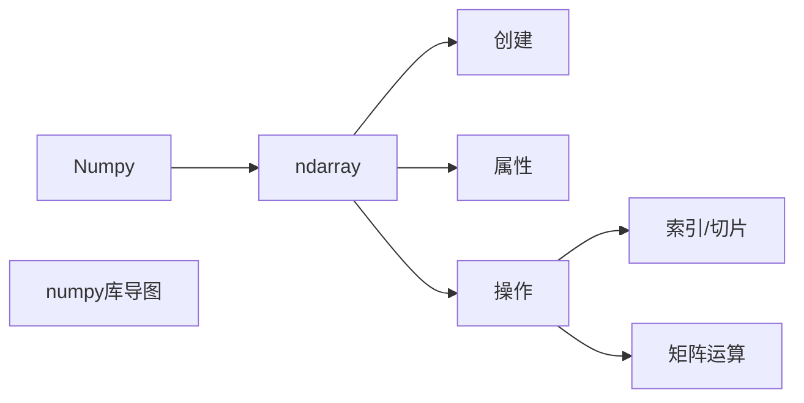

---
layout：post
title："Python数据分析 (1)Numpy库基础"
date：2020-11-1
author： "胡殊豪"
header-img： ""
tags:
	- python
	- Numpy
---
# Python数据分析-(1)Numpy库基础
*本篇文章约1200字，完整阅读并实现代码约需25min*

## 01、前言

Python最大的特点和优点之一应该就是其丰富多彩的库了，不论你想干什么，都总能找的一个python库满足你的要求。所以在掌握了Python基础语法后，出于各个方面的需要，我们也应该继续学习一些常见的Python库，下面为大家介绍在Python数据分析方面非常重要的**Numpy库**（本文的大体框架如图）

## 02、NumPy是什么/有什么用？

在学习具体的函数使用、数组创建、索引等知识前，私以为，我们应该先了解，**NumPy到底是什么**，我在什么时候会用到它，**为什么要用它**，为什么不用python自带的数组等等问题。接下来，让我们一一来解答这些问题。
### 1、NumPy到底是什么？
按照官方的说法，NumPy是使用Python进行科学计算的基础软件包。它包括：

- 功能强大的N维数组对象（ndarray）
- 精密广播功能函数
- 集成 C/C+和Fortran 代码的工具
- 强大的线性代数、傅立叶变换和随机数功能

按照我的理解，NumPy其实是一个典型的数据结构型的库，和C++中的< set >、< vector >等类似，都是**以一个数据结构（NumPy中的ndarry）为核心**，然后集成了一系列这个数据结构相关的属性、方法，我们学习这个库，其实就是在学习这个数据结构的属性和方法。
#### 2、NumPy真的很好用？
在计算机界，一个库、一个轮子的火热，很大程度上都应该是因为这个轮子很好用，NumPy的火热也是如此。通常来说，好用都是比出来的，我们先来比较一下NumPy数组（ndarray）和python数组（Array）之间的区别。
- NumPy 数组在创建时具有固定的大小，与Python的原生数组对象（可以动态增长）不同，更改ndarray的大小将创建一个新数组并删除原来的数组
- NumPy 数组中的元素都需要具有相同的数据类型，因此在内存中的大小相同
- NumPy 数组有助于对大量数据进行高级数学和其他类型的操作。通常，这些操作的执行效率更高，比使用Python原生数组的代码更少
- 越来越多的基于Python的科学和数学软件包使用NumPy数组; 虽然这些工具通常都支持Python的原生数组作为参数，但它们在处理之前会还是会将输入的数组转换为NumPy的数组，而且也通常输出为NumPy数组。换句话说，为了高效地使用当今科学/数学基于Python的工具（大部分的科学计算工具），你只知道如何使用Python的原生数组类型是不够的 ，还需要知道如何使用 NumPy 数组

说白了，就NumPy数组比python数组，**更快，更方便，功能更多**，同时NumPy本身还与python的其他科学和数学库有联系，所以学习NumPy是数据分析的重要基础。
#### 3、NumPy有些什么用？
前面说了这么多，大家可能还是不知道NumPy到底可以干什么，这里给大家一个简单的总结，一句话，**和矩阵有关的它都能干**。像什么，深度学习、数据分析、矩阵运算等等，都需要用到NumPy。

## 03、ndarray的创建和基本属性

前面说了一堆废话，我们还是抓紧时间来进入正题。正如前文所述，NumPy的核心就是ndarray这个数组，所以我们先来讲**怎么创建ndarray数组**。

上述就是常用的一些创建方法，然后我们来看看一个正常的**ndarray有哪些属性**。

我们其实可以在创建ndarray时就指定一些属性。

## 04、Numpy数组的花式索引/切片

小伙伴们应该都学过Python，Python数组有一个很好用的功能“**切片**”，你可以对一个python数组做各种**花里胡哨的索引**，NumPy数组也有同样的功能：

## 05、ndarray的运算
现在让我们来看看ndarray的运算操作，首先是最简单的**加减乘除**：

然后是**矩阵乘法以及一些常用的函数**：

最后，我们来介绍一个NumPy的特殊功能——**广播**。在NumPy的实际使用中，我们可能会遇到这样的情况，有两个ndarray，他们**形状不同**，但是我想对他们作一些运算，这时候不需要我们通过其他方式改变数组的形状，NumPy的广播机制可以直接让它们参与运算，具体实例如下：
讲一下我对广播机制的理解吧。如果需要广播，必然是一个大数组和一个小数组需要做运算，那就先看看两个数组的形状，例如上例中，x（3,3）和v（1,3）（也可以表示成（ ，3）），它们两个在列上相等且v的行数为1，所以就把v的行数从1增加到和x相等。
其实说穿了，广播主要也就这一种情况，**在某些维度上相等，在另外的维度上值为1**。

## 06、后记
到这里，NumPy的**基本操作**已经介绍完了（创建、属性、索引、运算），在接下来的博客中希望能继续为大家介绍有关Python数据分析的其他库。

*程序员有三种美德:懒惰,急躁和傲慢... 		——Larry Wall（Perl发明人）*

